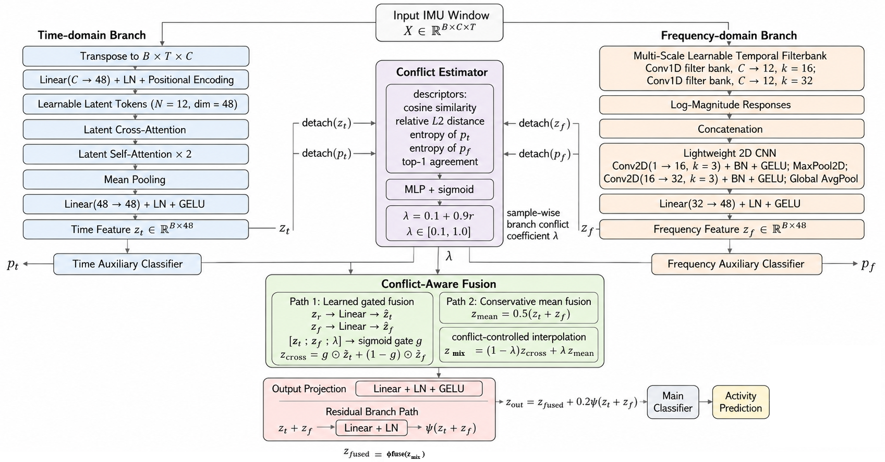

# Conflict-Aware Time–Frequency Reconciliation for Lightweight Sensor-Based Human Activity Recognition

<p align="center">
  
</p>

This repository implements the methodology proposed in the paper "Conflict-Aware Time–Frequency Reconciliation for Lightweight Sensor-Based Human Activity Recognition".


## Paper Overview
**Abstract**: Wearable-sensor-based human activity recognition
can benefit from jointly exploiting time- and frequency-domain
representations. However, the reliability of these representations
varies across activities and samples, and conventional fusion
methods may cause performance degradation when the two
domains provide inconsistent evidence. This paper proposes a
lightweight conflict-aware reconciliation framework that adap-
tively integrates temporal and frequency features according to
their sample-wise disagreement. A temporal encoder captures
long-range dependencies in raw sensor signals, while a learnable
multi-scale frequency branch extracts complementary spectral
characteristics. The proposed conflict estimator evaluates branch
disagreement using feature relations, predictive uncertainty, and
class consistency, and then regulates both feature reconciliation
and cross-branch agreement learning. Experiments on five public
HAR datasets show that the proposed framework consistently
outperforms the individual branches and conventional fusion
strategies, achieving Macro-F1 scores ranging from 0.9653 to
0.9845. Additional ablation, conflict, and perturbation analy-
ses verify the effectiveness of the proposed components and
demonstrate stable performance under sensor noise and signal
distortions. The compact model also achieves practical inference
efficiency on a Raspberry Pi 4, supporting its applicability to
resource-constrained wearable systems.


## Dataset
| Dataset  | Link |
|----------|------|
| UCI-HAR  | _https://archive.ics.uci.edu/dataset/240/human+activity+recognition+using+smartphones_ |
| PAMAP2   | _https://archive.ics.uci.edu/dataset/231/pamap2+physical+activity+monitoring_ |
| MHEALTH  | _https://archive.ics.uci.edu/dataset/319/mhealth+dataset_ |
| WISDM    | _https://www.cis.fordham.edu/wisdm/dataset.php_ |
| MotionSense    | _https://github.com/mmalekzadeh/motion-sense?tab=readme-ov-file_ |


## Requirements
```
torch==2.5.0+cu126
numpy==2.0.2
pandas==2.2.2
scikit-learn==1.6.1
matplotlib==3.10.0
seaborn==0.13.2
```
To install all required packages:
```
pip install -r requirements.txt
```

## Codebase Overview
- `model.py` - Implementation of the proposed **Lightweight Conflict-aware Reconciliation** framework.
The implementation uses PyTorch, Numpy, pandas, scikit-learn, matplotlib, seaborn.

## Citing this Repository

If you use this code in your research, please cite:

```
@article{Conflict-Aware Time–Frequency Reconciliation for Lightweight Sensor-Based Human Activity Recognition,
  title = {Conflict-Aware Time–Frequency Reconciliation for Lightweight Sensor-Based Human Activity Recognition},
  author={JunYoung Park and Myung-Kyu Yi}
  journal={},
  volume={},
  Issue={},
  pages={},
  year={}
  publisher={}
}
```

## Contact

For questions or issues, please contact:
- JunYoung Park : park91802@gmail.com

## License

This project is licensed under the MIT License - see the [LICENSE](LICENSE) file for details.
